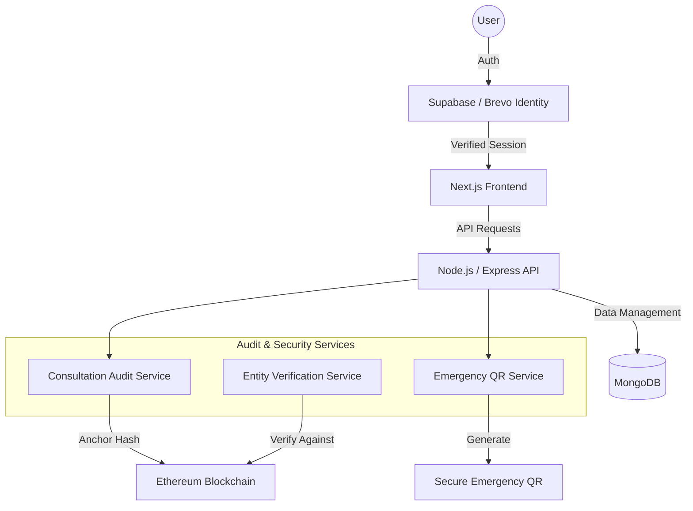
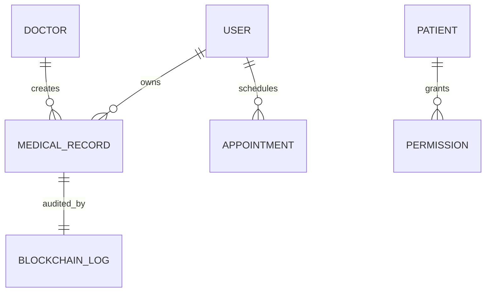

# MedChain Project Report

## 1. Title Page

**Project Title:** MedChain: A Secure and Transparent Blockchain-based Healthcare Platform  
**Authors:** [Member Name 1], [Member Name 2], [Member Name 3]  
**Institution:** [Your Institution Name]  
**Date:** April 2024  

---

## 2. Abstract

**MedChain** is a state-of-the-art healthcare management system that bridges the gap between traditional medical infrastructure and decentralized trust. By leveraging the **MERN stack** alongside **Supabase Identity** and **Ethereum Blockchain**, MedChain provides a multi-layered security model. The platform ensures data integrity through **blockchain-anchored audit logs**, patient safety via **Emergency QR Access**, and user trust through **Brevo-powered email verification**. With a focus on both physical and mental well-being, MedChain offers a comprehensive suite of tools for patients, doctors, and hospitals, all unified under a tamper-proof digital ledger.

---

## 3. Problem Statement

Healthcare data is often stored in silos, making emergency access difficult and data tampering hard to detect. Traditional systems lack a "Single Source of Truth" that is both accessible and immutable.

**The Complex Engineering Problem:**  
The challenge lies in providing **instant emergency access** to critical medical data (like allergies and blood type) without compromising long-term privacy, while ensuring that the data presented during an emergency hasn't been maliciously altered in the database. MedChain solves this by creating a **hybrid verification system** that validates local database records against on-chain cryptographic hashes in real-time.

---

## 4. System Architecture Diagram

The system follows a **Hybrid Decentralized Architecture** integrating Identity Management and Advanced Auditing Services.

---

## 5. Technology Stack Justification

*   **Next.js (React Framework)**: Selected for its Server-Side Rendering (SSR) capabilities, which improve performance and SEO.
*   **Supabase Auth**: Replaced custom identity management for higher security, supporting multi-factor authentication and managed sessions.
*   **Brevo (Sendinblue)**: Integrated for secure, transactional email verification to ensure only legitimate users access the medical portal.
*   **Ethereum (Hardhat)**: Provides the decentralized backbone for auditing.
*   **MongoDB Architecture**: Optimized for flexible JSON storage of medical records and profiles.

---

## 6. Module Description

1.  **Identity & Security**: A robust register/login flow with **Supabase** and **Next.js Middleware**, featuring email confirmation and password reset.
2.  **Emergency QR Module**: Enables patients to generate temporary, time-bound QR codes. Hospitals can scan these codes to instantly access life-saving information with **blockchain-verified integrity**.
3.  **Consultation Auditing**: Every online consultation automatically triggers a **deterministic audit**. This captures the doctor, patient, payment ID (Razorpay), and prescription summary into a single hash anchored on the blockchain.
4.  **Well-being Suite**: A "Mental Health" sanctuary featuring high-quality audio soundscapes, guided breathing, and a persistent, book-themed gratitude journal.
5.  **Audit Explorer**: A dashboard for admins and patients to view every action taken on their data and its current **verification status (Verified/Tampered)**.

---

## 7. Database Design

*   **User**: `id, supabaseUserId, email, role, profile_details`
*   **MedicalRecord**: `id, patient_id, content_hash, blockchainTxHash, timestamp`
*   **Permission**: `id, patient_id, authorized_user_id, access_level`
*   **Consultation**: `id, patient_id, doctor_id, blockchainHash, blockchainTimestamp`
*   **EmergencyLog**: `id, hospital_id, patient_id, access_time, status`

---

## 8. Implementation Details

*   **Deterministic Hashing**: Implemented a specialized service that converts complex JSON objects into a sorted, canonical string before hashing, ensuring data consistency on-chain.
*   **Verification Engine**: A service that recomputes hashes from live database objects and compares them with the latest on-chain logs to detect medical record tampering.
*   **Emergency QR Logic**: Uses short-lived, encrypted tokens embedded in QR codes to provide secure, temporary access to emergency profile data.

---

## 9. Screenshots Description

1.  **Dashboard (Patient)**: A crystal-clear grid layout showcasing health summaries and a "Verified" status badge from the blockchain.
2.  **Emergency Center**: A dedicated view showing the pulse-animated QR code with a countdown timer.
3.  **Blockchain Explorer**: A table view showing the cryptographic proof of medical consultations and record changes.
4.  **Mental Health Dash**: Vibrant, aesthetic cards for "Calming Sounds" and the "Gratitude Journal."

---

## 10. Contribution of Each Member

*   **Member 1**: Lead Developer — Architecture, Blockchain Services, and Supabase Integration.
*   **Member 2**: UI/UX Designer — Next.js Dashboards, Wellness Suite, and Tailwind Styling.
*   **Member 3**: Systems Engineer — Database Schema, Email Service integration, and Testing.

---

## 11. Challenges Faced & Solutions

*   **Challenge**: Ensuring data privacy on a public blockchain.
    *   **Solution**: Adopted a **Zero-Content Auditing** policy where only SHA-256 hashes are stored on-chain, keeping sensitive medical data strictly off-chain and encrypted.
*   **Challenge**: Multi-lingual support in the Health Chatbot.
    *   **Solution**: Implemented a local translation layer and voice recognition to support English, Hindi, Tamil, and Marathi.

---

## 12. Future Scope

*   **Decentralized Storage**: Integrating **IPFS** for storing large-scale medical images (MRI/X-rays).
*   **AI-Driven Diagnostics**: Adding proactive health risk assessments based on the patient's verified medical history.
*   **Mobile App**: Deploying a companion mobile application for instant emergency health alerts.

---

## 13. Conclusion

**MedChain** successfully demonstrates a hybrid approach to healthcare, combining the speed of modern web technologies with the absolute trust of blockchain. It provides a secure, efficient, and user-centric platform that protects patient data while saving lives in emergencies.

---

## 14. References

1.  *Supabase Documentation*
2.  *Hardhat & Ethers.js Developer Guides*
3.  *Next.js 14 App Router Patterns*
4.  *Blockchain Interoperability in Healthcare – Research Review*
